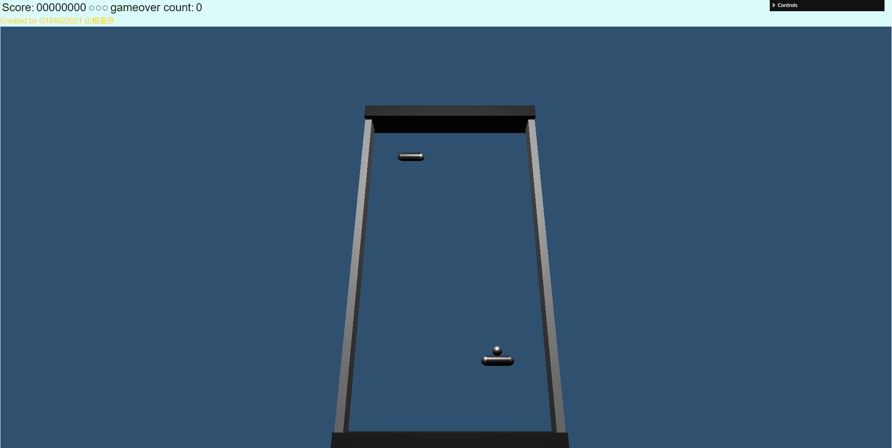

# タイトル

応用プログラミングレポート @G184922021 山根直弥

## 作品の概要
下の図のようなゲームセンターなどでよく見るエアーホッケーのようなものを作りました.

一人で上のパドルと下のパドルを操作し、ボールを上と下のデッドゾーンに当てないようになるべく多くの回数を往復させます.
パドルはマウスカーソルで動かし、下のパドルはマウスカーソルの動きそのままで動きますが、上のパドルはマウスカーソルと逆の方向に連動して動くようになっています.
上のパドルでボールを跳ね返すごとにスコアが加算されていき、連続でパドルにボールを当て続けると獲得できるスコアが多くなります. また、上のパドルに当てると少しずつボールのスピードが速くなっていきます.
ライフは3つあって3個目のライフがなくなるとゲームオーバーとなってしまいます.
ゲームオーバーになるとゲームオーバーカウントが溜まり、スコアとボールスピードとライフがリセットされます.

## 代表的な変数の説明

* `paddle` :パドルは中央部分と左右の端の部分で3つに分かれていたためそれを合わせて一つのオブジェクトにした.

* `ball` :ボールの形には`SphereGeometry`を用いて、作成した.

* `Frame` :外枠を作成する際には上、下、右、左で別々に作成した.
別々に作成することで、上と下の外枠ではボールが接触した時にボールを止めるなどの作業をしやすくなる.右と左の外枠ではボールを反射させるために用いていた.

## 工夫(苦心)したところ

*

*

*

*

## 感想
